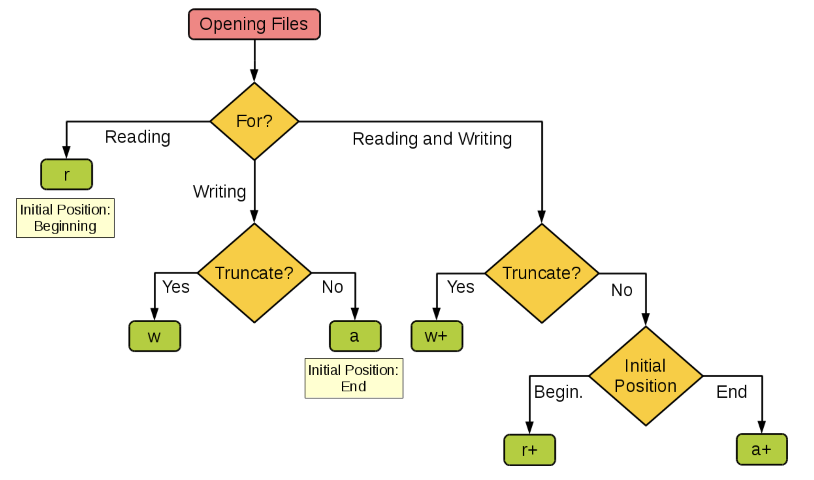
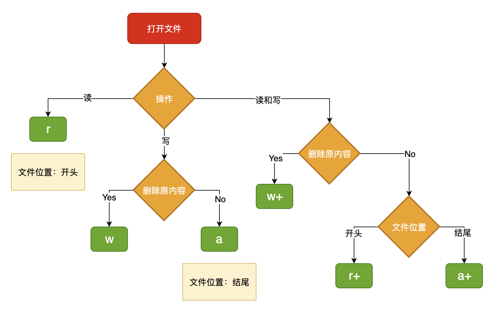
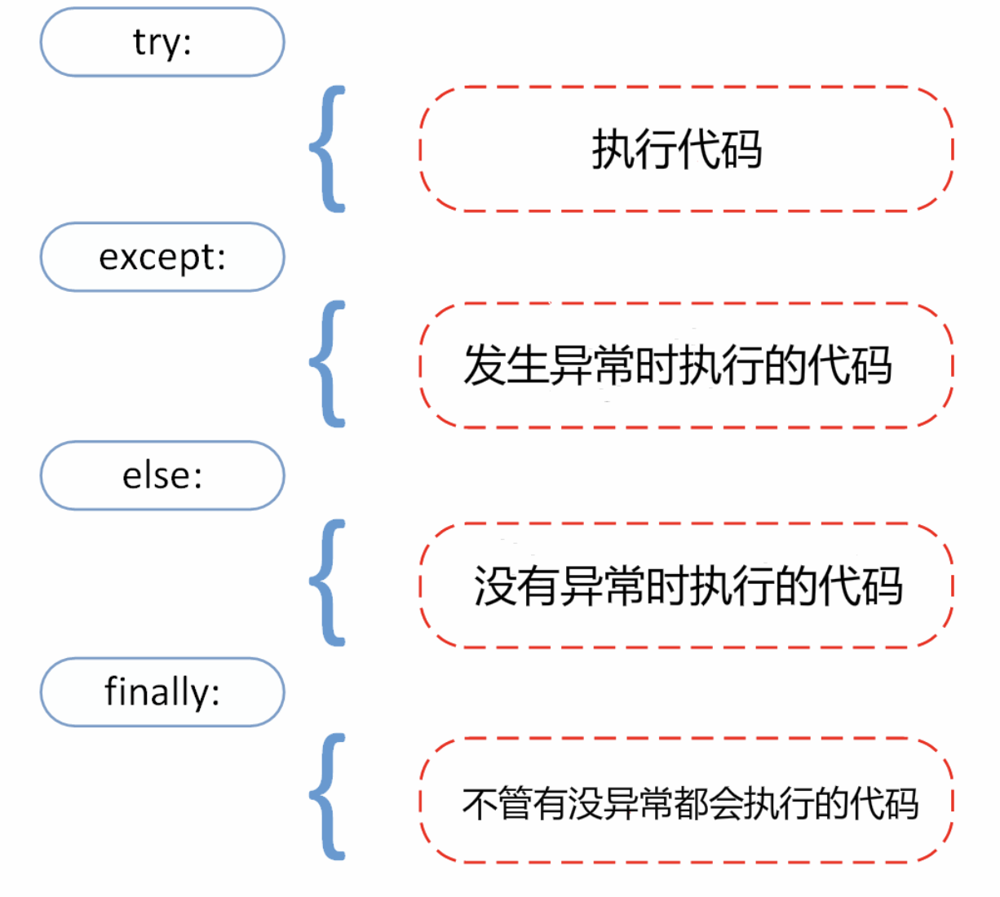

********文件和异常
-
### 文件
实现数据持久化最直接简单的方式就是将数据保存到文件中。

#### open()
```
open(file, mode='r')
```
完整语法
```
open(file, mode='r', buffering=-1, encoding=None, errors=None, newline=None, closefd=True, opener=None)
```
- file: <font color=#A52A2A >必需</font>，文件路径（相对或者绝对路径）。
- mode: <font color=#FF7F50 >可选</font>，文件打开模式
- buffering: 设置缓冲
- encoding: 一般使用<font color=#FF7F50 >utf8</font>
- errors: 报错级别
- newline: 区分换行符
- closefd: 传入的file参数类型
- opener: 设置自定义开启器，开启器的返回值必须是一个打开的文件描述符。


Python open() 方法用于打开一个文件，并返回文件对象，在对文件进行处理过程都需要使用到这个函数，如果该文件无法被打开，会抛出 OSError。

| 操作模式 | 具体含义                         |
| -------- | -------------------------------- |
| `'r'`    | 读取 （默认）                    |
| `'w'`    | 写入（会先截断之前的内容）       |
| `'x'`    | 写入，如果文件已经存在会产生异常 |
| `'a'`    | 追加，将内容写入到已有文件的末尾 |
| `'b'`    | 二进制模式                       |
| `'t'`    | 文本模式（默认）                 |
| `'+'`    | 更新（既可以读又可以写）         |
| `'w+'`    | 打开一个文件用于读写。如果该文件已存在则打开文件，并从开头开始编辑，即原有内容会被删除。如果该文件不存在，创建新文件。         |
| `'r+'`    | 打开一个文件用于读写。文件指针将会放在文件的开头。         |
| `'a+'`    | 打开一个文件用于读写。如果该文件已存在，文件指针将会放在文件的结尾。文件打开时会是追加模式。如果该文件不存在，创建新文件用于读写。         |

参考：[mode 参数](https://www.runoob.com/python3/python3-file-methods.html )


下面这张图来自于[菜鸟教程](https://www.runoob.com/python/python-files-io.html )，它展示了如果根据应用程序的需要来设置操作模式。






注意：
- 使用 open() 方法一定要保证关闭文件对象，即调用 close() 方法。
- open() 函数常用形式是接收两个参数：文件名(file)和模式(mode)。


#### 文件操作


| 操作方法   | 描述                         |
| -------- | -------------------------------- |
| <font color=#A52A2A >*</font>`file.close()`    | 关闭文件。关闭后文件不能再进行读写操作。                    |
| <font color=#A52A2A >*</font>`file.write(str)`    | 将字符串写入文件，返回的是写入的字符长度。               |
| <font color=#A52A2A >*</font>`file.read([size])`    | 从文件读取指定的字节数，如果未给定或为负则读取所有。                       |
| `file.flush()`    | 刷新文件内部缓冲，直接把内部缓冲区的数据立刻写入文件, 而不是被动的等待输出缓冲区写入。       |
| `file.fileno()`    | 返回一个整型的文件描===========述符(file descriptor FD 整型), 可以用在如os模块的read方法等一些底层操作上。 |
| `file.isatty()`    | 如果文件连接到一个终端设备返回 True，否则返回 False。 |
| `file.readline([size])`    | 读取整行，包括 "\n" 字符。                 |
| `file.readlines([sizeint])`    | 读取所有行并返回列表，若给定sizeint>0，返回总和大约为sizeint字节的行, 实际读取值可能比 sizeint 较大, 因为需要填充缓冲区。         |
| `file.seek(offset[, whence])`    | 移动文件读取指针到指定位置         |
| `file.tell()`    | 返回文件当前位置。         |
| `file.truncate([size])`    | 从文件的首行首字符开始截断，截断文件为 size 个字符，无 size 表示从当前位置截断；截断之后后面的所有字符被删除，其中 windows 系统下的换行代表2个字符大小。         |
| `file.writelines(sequence)`    | 向文件写入一个序列字符串列表，如果需要换行则要自己加入每行的换行符。                |

参考：[文件操作常用函数](https://www.runoob.com/python3/python3-file-methods.html )


### 异常



补充：Python 使用 raise 语句抛出一个指定的异常。


### 读写JSON文件
JSON跟Python中的字典其实是一样一样的，事实上JSON的数据类型和Python的数据类型是很容易找到对应关系的，如下面两张表所示。

| JSON                | Python       |
| ------------------- | ------------ |
| object              | dict         |
| array               | list         |
| string              | str          |
| number (int / real) | int / float  |
| true / false        | True / False |
| null                | None         |

| Python                                 | JSON         |
| -------------------------------------- | ------------ |
| dict                                   | object       |
| list, tuple                            | array        |
| str                                    | string       |
| int, float, int- & float-derived Enums | number       |
| True / False                           | true / false |
| None                                   | null         |


json模块主要有四个比较重要的函数，分别是：

- `dump` - 将Python对象按照JSON格式序列化到文件中
- `dumps` - 将Python对象处理成JSON格式的字符串
- `load` - 将文件中的JSON数据反序列化成对象
- `loads` - 将字符串的内容反序列化成Python对象


序列化（serialization）在计算机科学的数据处理中，是指将数据结构或对象状态转换为可以存储或传输的形式，这样在需要的时候能够恢复到原先的状态，而且通过序列化的数据重新获取字节时，可以利用这些字节来产生原始对象的副本（拷贝）。与这个过程相反的动作，即从一系列字节中提取数据结构的操作，就是反序列化（deserialization）

